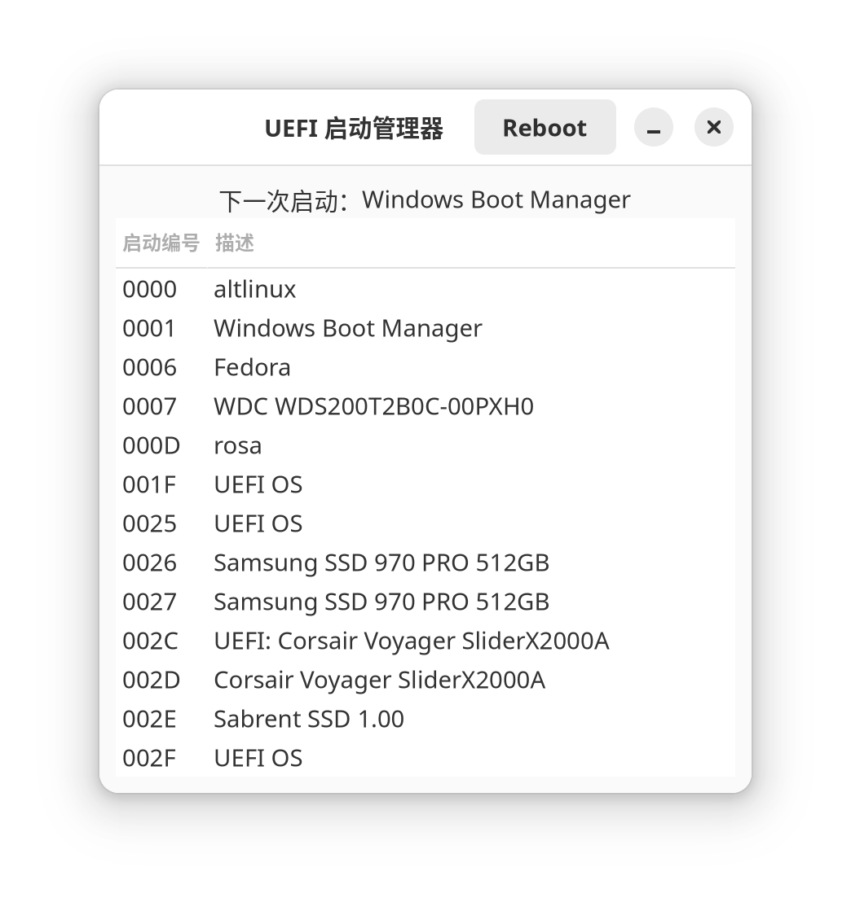

# UEFI 启动管理器

[🇬🇧 EN](/Readme.md)
[🇷🇺 RU](/Readme.RU.md)

## 概览
该项目是一个简单的图形应用程序，用于管理 GNU/Linux 系统上的 UEFI 启动队列。应用程序提供了一个图形界面，通过 `efibootmgr` 查看和修改系统的启动顺序。

## 要求
开始之前，请确保您安装了以下组件：
- Python 3.6 或更新版本
- GTK 4
- PyGObject
- efibootmgr

## 安装依赖
使用 pip 安装必要的 Python 库：
pip install -r requirements.txt

## 运行应用程序
使用以下命令启动应用程序：
python3 main.py

其中 `main.py` 是您的主应用文件。