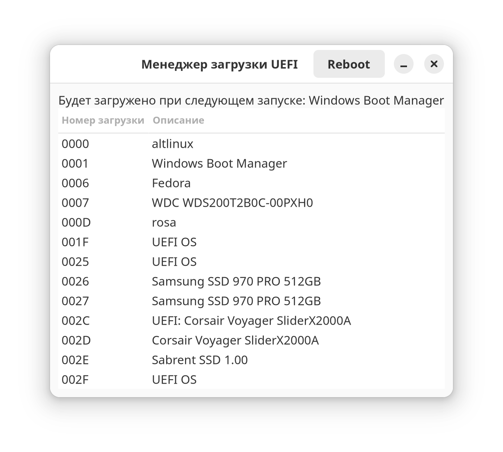

# Менеджер загрузки UEFI 

[🇨🇳 CN](/Readme.CN.md)
[🇬🇧 EN](/Readme.md)

## Обзор
Проект представляет собой простое графическое приложение для управления UEFI очередью загрузки на системах GNU/Linux. Приложение предоставляет графический интерфейс для просмотра и изменения порядка загрузки системы через `efibootmgr`.



## Требования
Перед началом работы убедитесь, что у вас установлены следующие компоненты:
- Python 3.6 или новее
- GTK 4
- PyGObject
- efibootmgr

## Установка зависимостей
Установите необходимые библиотеки Python с помощью pip:
pip install -r requirements.txt

## Запуск приложения
Запустите приложение командой:

```shell
python3 main.py
```

где `main.py` - ваш основной файл приложения.
