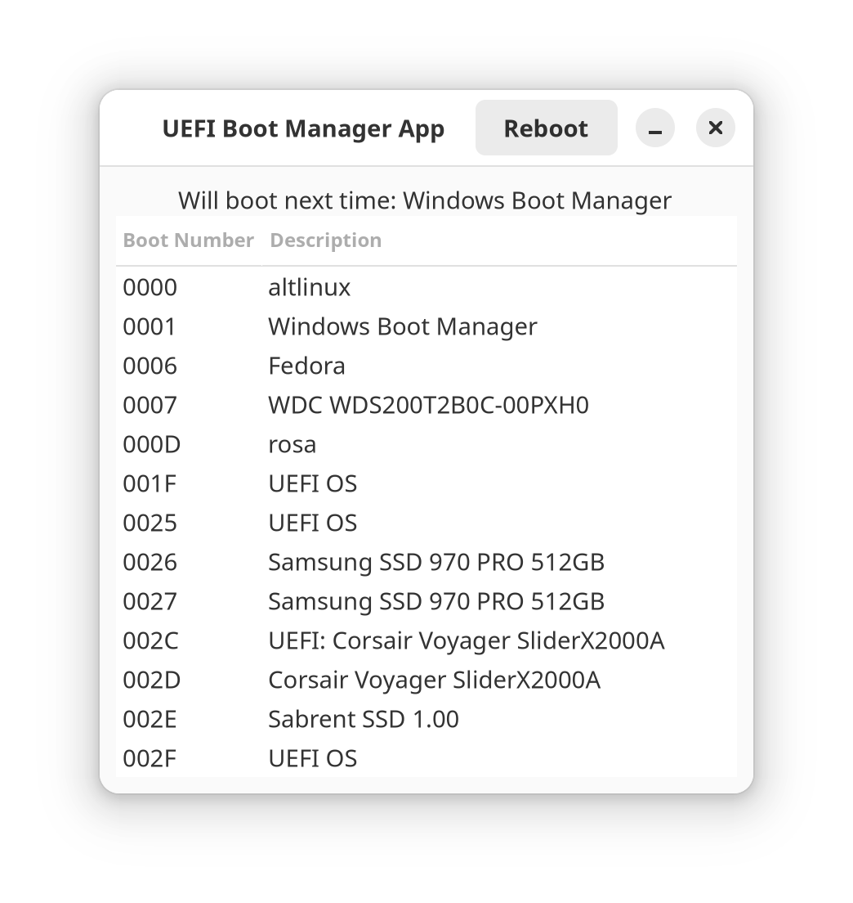

# UEFI Boot Manager App

[🇨🇳 CN](/Readme.CN.md)
[🇷🇺 RU](/Readme.RU.md)

## Overview
The project is a simple graphical application for managing the UEFI boot queue on GNU/Linux systems. The application provides a graphical interface for viewing and modifying the system's boot order through `efibootmgr`.



## Requirements
Before getting started, make sure you have the following components installed:
- Python 3.6 or newer
- GTK 4
- PyGObject
- efibootmgr

## Installing Dependencies
Install the necessary Python libraries using pip:
pip install -r requirements.txt

## Running the Application
Launch the application with the command:

```shell
python3 main.py
```

where `main.py` is your main application file.